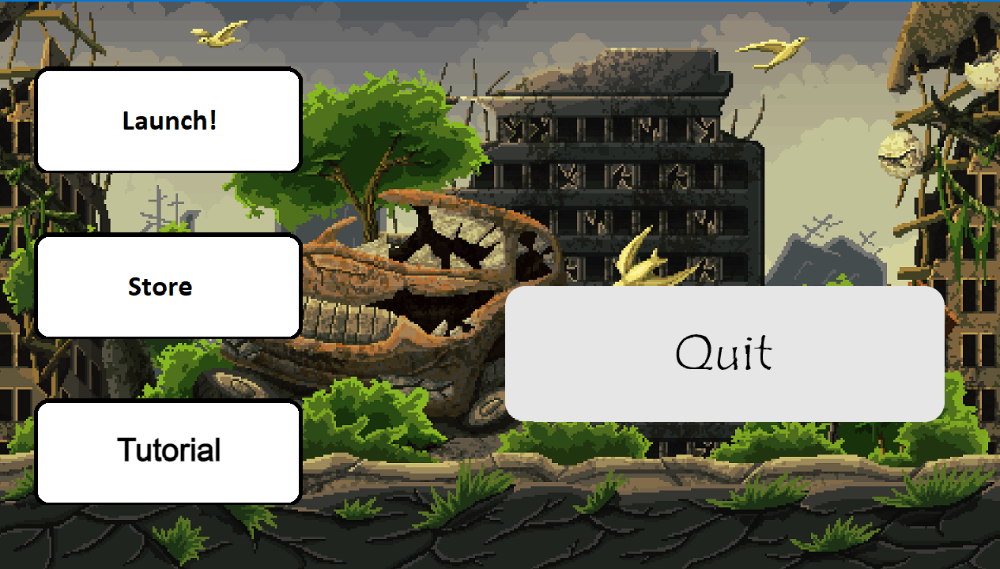

# CptS 122 PA 9: Zombie Game

## Collaborators
- [Aidan Gooding](https://github.com/WhyPine) (Lab Section 10)
- [Josh Maloy](https://github.com/Jiinja) (Lab Section 6)
- [Orion Green](https://github.com/oriongreen) (Lab Section 6)
- [Zach Fechko](https://github.com/zfechko) (Lab Section 6)

## Game Description
You are a lone survivor in a zombie apocalypse who has to survive what seems like endless waves of zombies coming to kill you, you must use the weapons you have at your disposal to survive for as many rounds as you can.
Click the image below to watch a video demonstration of our game

## The Map

The map is broken up into four quadrants:
1. **City** (top left)
2. **Military Base** (top right)
3. **Garden** (bottom left)
4. **Hospital** (bottom right)

The player begins the game in the city, and as gameplay progresses, the player will be able to access the other three quadrants. Some quadrants even have rooms that stretch to adjacent quadrants as well, without having to unlock the main doors.

## Controls
- W Move up
- A Move left
- S Move down
- D Move right
- R Reload
- E Interact
- Move your mouse to aim
- Left Click to shoot

## Test Cases
To access the test environment you select a save and then press F1 once you are at the following screen

Once you do this you will be brought into the test environment and the application will automatically run through the following tests
1. **Bullet Collision:** The game spawns a zombie and a bullet, if the zombie dies when the bullet touches it the test is a success
2. **Out of Bounds:** The game spawns a zombie outside of the boundaries of the map, if the zombie gets teleported back in bounds, the test succeeds.
3. **Wall Collision:**  The game spawns a zombie against a wall and if the collision system prevents movement, the test succeeds
4. **Bullet Penetration:** Like the first test the game spawns a zombie and a bullet, on contact the bullet compares the zombie it's in contact with to a list of already hit zombies, if the bullet passes through the zombie without doing damage, the test succeeds.
5. **Second Wind:** The game gives the player the second wind perk and then kills the player by setting their health to zero, if the player's health refills and their ammo count is reloaded then the perk works as intended
