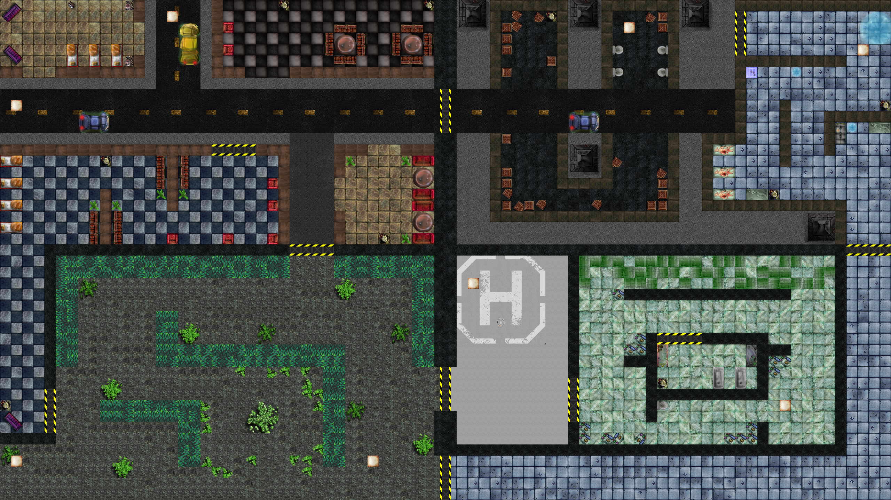

# CptS 122 PA 9: Zombie Game

## Collaborators
- Aidan Gooding (Lab Section 10)
- Josh Maloy (Lab Section 6)
- Orion Green (Lab Section 6)
- Zach Fechko (Lab Section 6)

## Game Description
You are a lone survivor in a zombie apocalypse who has to survive what seems like endless waves of zombies coming to kill you, you must use the weapons you have at your disposal to survive for as many rounds as you can.

## The Map

The map is broken up into four quadrants:
1. **City** (top left)
2. **Military Base** (top right)
3. **Garden** (bottom left)
4. **Hospital** (bottom right)

The player begins the game in the city, and as gameplay progresses, the player will be able to access the other three quadrants. Some quadrants even have rooms that stretch to adjacent quadrants as well, without having to unlock the main doors.

## Controls
- W Move up
- A Move left
- S Move down
- D Move right
- R Reload
- E Interact
- Move your mouse to aim
- Left Click to shoot

## Test Cases we Implemented
1. Testing collision detection by printing "Player touching a wall" to the console if the player is touching a wall
2. Printing the health of the zombie to the console to verify that it takes damage
3. Printing the direction vector of a bullet when it was fired from the gun
4. Testing collisions by printing what side of a wall the player was touching

## Remaining Tasks
- [ ] Developing more zombie types (runners, bigbois, etc.)
- [ ] Move buy boxes around
- [ ] Tweak main menu
- [ ] Dying
- [ ] Skill updating
- [ ] Video demo for turn in (This is the most important out of all of these)
- [ ] Actual test cases and not just printing stuff to the console
- [ ] Save system
- [ ] Skill system
